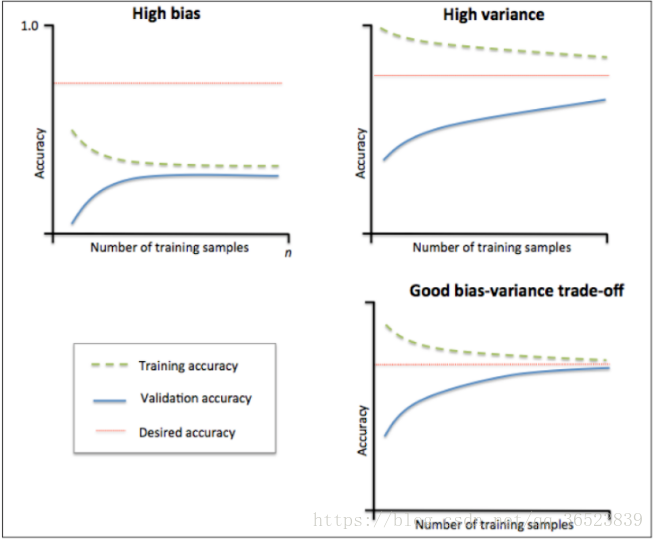

# 建模调参

## 一、概述

### 1.1. 线性回归模型

#### 线性回归对于特征的要求

* 特征符合线性行和可加性。假设因变量为Y，自变量为X1，X2，则回归分析的默认假设为Y=b+a1X1+a2X2+ε。
    线性性：X1每变动一个单位，Y相应变动a1个单位，与X1的绝对数值大小无关。可加性：X1对Y的影响是独立于其他自变量（如X2）的。
* 特征之间应相互独立。

#### 处理长尾分布

#### 理解线性回归模型

* 线性回归五大假设：1）线性性 & 可加性，2）误差项（ε）之间应相互独立，3）自变量（X1，X2）之间应相互独立，4）误差项（ε）的方差应为常数，5）误差项（ε）应呈正态分布
* 线性回归最普通的形式是


    其中x向量代表一条样本{x1,x2,x3....xn}，其中x1，x2，x3代表样本的各个特征，w是一条向量代表了每个特征所占的权重，b是一个标量代表特征都为0时的预测值，可以视为模型的basis或者bias。
* 损失函数。一个学习过程分为了三部分：模型、策略、算法，为了获得w和b一般采取以下策略：减少在测试集上的预测值f(x)与真实值y的差别，从而获得一个最佳的权重参数，因此这里采用最小二乘估计。


* 优化方法。

    最小二乘优化的思路是线性代数中的矩阵求导，让loss取到最小，只需要对这个式子进行求导，导数为0的地方就是极值点。


    梯度下降的策略是一步一步的往让loss变到最小值的方向走，直到走到那个点。


### 1.2. 模型性能验证

#### 评价函数与目标函数

* 目标函数是最终需要优化的函数(obj=loss+Ω)，其中包括经验损失和结构损失。经验损失(loss)就是损失函数/代价函数。结构损失(Ω)就是正则项之类的来控制模型复杂程度的函数。
* 评价函数即损失函数/代价函数，用于评估预测值和真实值差异。常用有：平均绝对误差（Mean Absolute Error，MAE），均方误差（Mean Squared Error，MSE），平均绝对百分误差（Mean Absolute Percentage Error，MAPE），均方根误差（Root Mean Squared Error）， R2（R-Square）。

#### 交叉验证方法

 * K折交叉验证，初始采样分割成K个子样本，一个单独的子样本被保留作为验证模型的数据，其他K-1个样本用来训练。交叉验证重复K次，每个子样本验证一次，平均K次的结果或者使用其它结合方式，最终得到一个单一估测。这个方法的优势在于，同时重复运用随机产生的子样本进行训练和验证，每次的结果验证一次，10折交叉验证是最常用的。

#### 留一验证方法

* 只使用原本样本中的一项来当做验证资料， 而剩余的则留下来当做训练资料。 这个步骤一直持续到每个样本都被当做一次验证资料。 事实上，这等同于和K-fold 交叉验证是一样的，其中K为原本样本个数。 

#### 针对时间序列问题的验证

* 在某些与时间相关的数据集上，只能通过前面的数据预测后面的结果，使用交叉验证反而反映了不真实的情况，如通过2018年的二手车价格预测2017年的二手车价格。因此需要采用时间顺序对数据集进行分隔，选用靠前时间的(k-1)/k样本当作训练集，靠后时间的1/k当作验证集

#### 学习率曲线作用

* 一种用来判断训练模型的一种方法，通过观察绘制出来的学习曲线图，我们可以比较直观的了解到我们的模型处于一个什么样的状态，如：过拟合（overfitting）或欠拟合（underfitting）

1) 观察左上图，训练集准确率与验证集准确率收敛，但是两者收敛后的准确率远小于我们的期望准确率（上面那条红线），所以由图可得该模型属于欠拟合（underfitting）问题。由于欠拟合，所以我们需要增加模型的复杂度，比如，增加特征、增加树的深度、减小正则项等等，此时再增加数据量是不起作用的。
2) 观察右上图，训练集准确率高于期望值，验证集则低于期望值，两者之间有很大的间距，误差很大，对于新的数据集模型适应性较差，所以由图可得该模型属于过拟合（overfitting）问题。由于过拟合，所以我们降低模型的复杂度，比如减小树的深度、增大分裂节点样本数、增大样本数、减少特征数等等。
3) 一个比较理想的学习曲线图应当是：低偏差、低方差，即收敛且误差小。

#### 验证曲线的作用

* 验证曲线和学习曲线的区别是，横轴为某个超参数的一系列值，由此来看不同参数设置下模型的准确率，而不是不同训练集大小下的准确率。
    从验证曲线上可以看到随着超参数设置的改变，模型可能从欠拟合到合适再到过拟合的过程，进而选择一个合适的设置，来提高模型的性能。

### 1.3. 嵌入式特征选择

* L1正则化有助于生成一个稀疏权值矩阵，进而可以用于特征选择。
* L2正则化在拟合过程中通常都倾向于让权值尽可能小，最后构造一个所有参数都比较小的模型。因为一般认为参数值小的模型比较简单，能适应不同的数据集，也在一定程度上避免了过拟合现象。
* Lasso回归使用L2正则化，岭回归使用L1正则化。
* 决策树通过信息熵或GINI指数选择分裂节点时，优先选择的分裂特征也更加重要，这同样是一种特征选择的方法。

### 1.4. 模型调参

#### 贪心调参方法

* 所谓贪心算法是指，在对问题求解时，总是做出在当前看来是最好的选择。也就是说，不从整体最优上加以考虑，它所做出的仅仅是在某种意义上的局部最优解。适用的前提是：局部最优策略能导致产生全局最优解。
* 基本思路

1) 建立数学模型来描述问题

2) 把求解的问题分成若干个子问题

3) 对每个子问题求解，得到子问题的局部最优解

4) 把子问题的解局部最优解合成原来问题的一个解

#### 网格调参方法

* 通过循环遍历，尝试每一种参数组合，返回最好的得分值的参数组合。
* GridSearchCV能够使我们找到范围内最优的参数，param_grid参数越多，组合越多，计算的时间也需要越多，GridSearchCV使用于小数据集。

#### 贝叶斯调参方法

* 贝叶斯优化通过基于目标函数的过去评估结果建立替代函数（概率模型），来找到最小化目标函数的值。贝叶斯方法与随机或网格搜索的不同之处在于，它在尝试下一组超参数时，会参考之前的评估结果，因此可以省去很多无用功。
* 基本思路

1) 目标函数：我们想要最小化的内容，在这里，目标函数是机器学习模型使用该组超参数在验证集上的损失。

2) 域空间：要搜索的超参数的取值范围

3) 优化算法：构造替代函数并选择下一个超参数值进行评估的方法。

4) 结果历史记录：来自目标函数评估的存储结果，包括超参数和验证集上的损失。

## 二、代码实战

### 2.1 读取数据

```python
import pandas as pd
import numpy as np
import warnings
warnings.filterwarnings('ignore')
```

reduce_mem_usage 函数通过调整数据类型，帮助我们减少数据在内存中占用的空间


```python
def reduce_mem_usage(df):
    """ iterate through all the columns of a dataframe and modify the data type
        to reduce memory usage.        
    """
    start_mem = df.memory_usage().sum() 
    print('Memory usage of dataframe is {:.2f} MB'.format(start_mem))
    
    for col in df.columns:
        col_type = df[col].dtype
        
        if col_type != object:
            c_min = df[col].min()
            c_max = df[col].max()
            if str(col_type)[:3] == 'int':
                if c_min > np.iinfo(np.int8).min and c_max < np.iinfo(np.int8).max:
                    df[col] = df[col].astype(np.int8)
                elif c_min > np.iinfo(np.int16).min and c_max < np.iinfo(np.int16).max:
                    df[col] = df[col].astype(np.int16)
                elif c_min > np.iinfo(np.int32).min and c_max < np.iinfo(np.int32).max:
                    df[col] = df[col].astype(np.int32)
                elif c_min > np.iinfo(np.int64).min and c_max < np.iinfo(np.int64).max:
                    df[col] = df[col].astype(np.int64)  
            else:
                if c_min > np.finfo(np.float16).min and c_max < np.finfo(np.float16).max:
                    df[col] = df[col].astype(np.float16)
                elif c_min > np.finfo(np.float32).min and c_max < np.finfo(np.float32).max:
                    df[col] = df[col].astype(np.float32)
                else:
                    df[col] = df[col].astype(np.float64)
        else:
            df[col] = df[col].astype('category')

    end_mem = df.memory_usage().sum() 
    print('Memory usage after optimization is: {:.2f} MB'.format(end_mem))
    print('Decreased by {:.1f}%'.format(100 * (start_mem - end_mem) / start_mem))
    return df
```


```python
sample_feature = reduce_mem_usage(pd.read_csv('data_for_tree.csv'))
```

    Memory usage of dataframe is 60507328.00 MB
    Memory usage after optimization is: 15724107.00 MB
    Decreased by 74.0%
    


```python
continuous_feature_names = [x for x in sample_feature.columns if x not in ['price','brand','model','brand']]
```

### 2.2 线性回归 & 五折交叉验证 & 模拟真实业务情况


```python
sample_feature = sample_feature.dropna().replace('-', 0).reset_index(drop=True)
sample_feature['notRepairedDamage'] = sample_feature['notRepairedDamage'].astype(np.float32)
train = sample_feature[continuous_feature_names + ['price']]

train_X = train[continuous_feature_names]
train_y = train['price']
```

#### 2.2 - 1 简单建模


```python
from sklearn.linear_model import LinearRegression
```


```python
model = LinearRegression(normalize=True)
```


```python
model = model.fit(train_X, train_y)
```

查看训练的线性回归模型的截距（intercept）与权重(coef)


```python
'intercept:'+ str(model.intercept_)

sorted(dict(zip(continuous_feature_names, model.coef_)).items(), key=lambda x:x[1], reverse=True)
```

```python
from matplotlib import pyplot as plt
subsample_index = np.random.randint(low=0, high=len(train_y), size=50)
```

绘制特征v_9的值与标签的散点图，图片发现模型的预测结果（蓝色点）与真实标签（黑色点）的分布差异较大，且部分预测值出现了小于0的情况，说明我们的模型存在一些问题


```python
plt.scatter(train_X['v_9'][subsample_index], train_y[subsample_index], color='black')
plt.scatter(train_X['v_9'][subsample_index], model.predict(train_X.loc[subsample_index]), color='blue')
plt.xlabel('v_9')
plt.ylabel('price')
plt.legend(['True Price','Predicted Price'],loc='upper right')
print('The predicted price is obvious different from true price')
plt.show()
```


通过作图我们发现数据的标签（price）呈现长尾分布，不利于我们的建模预测。原因是很多模型都假设数据误差项符合正态分布，而长尾分布的数据违背了这一假设。

```python
import seaborn as sns
print('It is clear to see the price shows a typical exponential distribution')
plt.figure(figsize=(15,5))
plt.subplot(1,2,1)
sns.distplot(train_y)
plt.subplot(1,2,2)
sns.distplot(train_y[train_y < np.quantile(train_y, 0.9)])
```


在这里我们对标签进行了 $log(x+1)$ 变换，使标签贴近于正态分布


```python
train_y_ln = np.log(train_y + 1)
```


```python
import seaborn as sns
print('The transformed price seems like normal distribution')
plt.figure(figsize=(15,5))
plt.subplot(1,2,1)
sns.distplot(train_y_ln)
plt.subplot(1,2,2)
sns.distplot(train_y_ln[train_y_ln < np.quantile(train_y_ln, 0.9)])
```


```python
model = model.fit(train_X, train_y_ln)
```

再次进行可视化，发现预测结果与真实值较为接近，且未出现异常状况


```python
plt.scatter(train_X['v_9'][subsample_index], train_y[subsample_index], color='black')
plt.scatter(train_X['v_9'][subsample_index], np.exp(model.predict(train_X.loc[subsample_index])), color='blue')
plt.xlabel('v_9')
plt.ylabel('price')
plt.legend(['True Price','Predicted Price'],loc='upper right')
print('The predicted price seems normal after np.log transforming')
plt.show()
```


#### 2.2 - 2 五折交叉验证

> 在使用训练集对参数进行训练的时候，经常会发现人们通常会将一整个训练集分为三个部分（比如mnist手写训练集）。一般分为：训练集（train_set），评估集（valid_set），测试集（test_set）这三个部分。这其实是为了保证训练效果而特意设置的。其中测试集很好理解，其实就是完全不参与训练的数据，仅仅用来观测测试效果的数据。而训练集和评估集则牵涉到下面的知识了。

>因为在实际的训练中，训练的结果对于训练集的拟合程度通常还是挺好的（初始条件敏感），但是对于训练集之外的数据的拟合程度通常就不那么令人满意了。因此我们通常并不会把所有的数据集都拿来训练，而是分出一部分来（这一部分不参加训练）对训练集生成的参数进行测试，相对客观的判断这些参数对训练集之外的数据的符合程度。这种思想就称为交叉验证（Cross Validation）


```python
from sklearn.model_selection import cross_val_score
from sklearn.metrics import mean_absolute_error,  make_scorer

def log_transfer(func):
    def wrapper(y, yhat):
        result = func(np.log(y), np.nan_to_num(np.log(yhat)))
        return result
    return wrapper
```


```python
scores = cross_val_score(model, X=train_X, y=train_y, verbose=1, cv = 5, scoring=make_scorer(log_transfer(mean_absolute_error)))
```

使用线性回归模型，对未处理标签的特征数据进行五折交叉验证（Error 1.36）


```python
print('AVG:', np.mean(scores))
```

    AVG: 1.3641908155886227
    

使用线性回归模型，对处理过标签的特征数据进行五折交叉验证（Error 0.19）


```python
scores = cross_val_score(model, X=train_X, y=train_y_ln, verbose=1, cv = 5, scoring=make_scorer(mean_absolute_error))
```

```python
print('AVG:', np.mean(scores))
```

    AVG: 0.19382863663604424
    


```python
scores = pd.DataFrame(scores.reshape(1,-1))
scores.columns = ['cv' + str(x) for x in range(1, 6)]
scores.index = ['MAE']
scores
```


<div>
<style scoped>
    .dataframe tbody tr th:only-of-type {
        vertical-align: middle;
    }

    .dataframe tbody tr th {
        vertical-align: top;
    }

    .dataframe thead th {
        text-align: right;
    }
</style>
<table border="1" class="dataframe">
  <thead>
    <tr style="text-align: right;">
      <th></th>
      <th>cv1</th>
      <th>cv2</th>
      <th>cv3</th>
      <th>cv4</th>
      <th>cv5</th>
    </tr>
  </thead>
  <tbody>
    <tr>
      <th>MAE</th>
      <td>0.191642</td>
      <td>0.194986</td>
      <td>0.192737</td>
      <td>0.195329</td>
      <td>0.19445</td>
    </tr>
  </tbody>
</table>
</div>


#### 2.2 - 3 模拟真实业务情况

但在事实上，由于我们并不具有预知未来的能力，五折交叉验证在某些与时间相关的数据集上反而反映了不真实的情况。通过2018年的二手车价格预测2017年的二手车价格，这显然是不合理的，因此我们还可以采用时间顺序对数据集进行分隔。在本例中，我们选用靠前时间的4/5样本当作训练集，靠后时间的1/5当作验证集，最终结果与五折交叉验证差距不大

```python
import datetime

sample_feature = sample_feature.reset_index(drop=True)

split_point = len(sample_feature) // 5 * 4

train = sample_feature.loc[:split_point].dropna()
val = sample_feature.loc[split_point:].dropna()

train_X = train[continuous_feature_names]
train_y_ln = np.log(train['price'] + 1)
val_X = val[continuous_feature_names]
val_y_ln = np.log(val['price'] + 1)
```

```python
model = model.fit(train_X, train_y_ln)

mean_absolute_error(val_y_ln, model.predict(val_X))
```

    0.19443858353490887

#### 2.2 - 4 绘制学习率曲线与验证曲线

```python
from sklearn.model_selection import learning_curve, validation_curve

def plot_learning_curve(estimator, title, X, y, ylim=None, cv=None,n_jobs=1, train_size=np.linspace(.1, 1.0, 5 )):  
    plt.figure()  
    plt.title(title)  
    if ylim is not None:  
        plt.ylim(*ylim)  
    plt.xlabel('Training example')  
    plt.ylabel('score')  
    train_sizes, train_scores, test_scores = learning_curve(estimator, X, y, cv=cv, n_jobs=n_jobs, train_sizes=train_size, scoring = make_scorer(mean_absolute_error))  
    train_scores_mean = np.mean(train_scores, axis=1)  
    train_scores_std = np.std(train_scores, axis=1)  
    test_scores_mean = np.mean(test_scores, axis=1)  
    test_scores_std = np.std(test_scores, axis=1)  
    plt.grid()#区域  
    plt.fill_between(train_sizes, train_scores_mean - train_scores_std,  
                     train_scores_mean + train_scores_std, alpha=0.1,  
                     color="r")  
    plt.fill_between(train_sizes, test_scores_mean - test_scores_std,  
                     test_scores_mean + test_scores_std, alpha=0.1,  
                     color="g")  
    plt.plot(train_sizes, train_scores_mean, 'o-', color='r',  
             label="Training score")  
    plt.plot(train_sizes, test_scores_mean,'o-',color="g",  
             label="Cross-validation score")  
    plt.legend(loc="best")  
    return plt  

plot_learning_curve(LinearRegression(), 'Liner_model', train_X[:1000], train_y_ln[:1000], ylim=(0.0, 0.5), cv=5, n_jobs=1)  
```


#### 2.3 多种模型对比


```python
train = sample_feature[continuous_feature_names + ['price']].dropna()

train_X = train[continuous_feature_names]
train_y = train['price']
train_y_ln = np.log(train_y + 1)
```

#### 2.3 - 1 线性模型 & 嵌入式特征选择

```python
from sklearn.linear_model import LinearRegression
from sklearn.linear_model import Ridge
from sklearn.linear_model import Lasso

models = [LinearRegression(),
          Ridge(),
          Lasso()]

result = dict()
for model in models:
    model_name = str(model).split('(')[0]
    scores = cross_val_score(model, X=train_X, y=train_y_ln, verbose=0, cv = 5, scoring=make_scorer(mean_absolute_error))
    result[model_name] = scores
    print(model_name + ' is finished')
```

对三种方法的效果对比


```python
result = pd.DataFrame(result)
result.index = ['cv' + str(x) for x in range(1, 6)]
result
```


<div>
<style scoped>
    .dataframe tbody tr th:only-of-type {
        vertical-align: middle;
    }

    .dataframe tbody tr th {
        vertical-align: top;
    }

    .dataframe thead th {
        text-align: right;
    }
</style>
<table border="1" class="dataframe">
  <thead>
    <tr style="text-align: right;">
      <th></th>
      <th>LinearRegression</th>
      <th>Ridge</th>
      <th>Lasso</th>
    </tr>
  </thead>
  <tbody>
    <tr>
      <th>cv1</th>
      <td>0.191642</td>
      <td>0.195665</td>
      <td>0.382708</td>
    </tr>
    <tr>
      <th>cv2</th>
      <td>0.194986</td>
      <td>0.198841</td>
      <td>0.383916</td>
    </tr>
    <tr>
      <th>cv3</th>
      <td>0.192737</td>
      <td>0.196629</td>
      <td>0.380754</td>
    </tr>
    <tr>
      <th>cv4</th>
      <td>0.195329</td>
      <td>0.199255</td>
      <td>0.385683</td>
    </tr>
    <tr>
      <th>cv5</th>
      <td>0.194450</td>
      <td>0.198173</td>
      <td>0.383555</td>
    </tr>
  </tbody>
</table>
</div>


```python
model = LinearRegression().fit(train_X, train_y_ln)
print('intercept:'+ str(model.intercept_))
sns.barplot(abs(model.coef_), continuous_feature_names)
```

    intercept:23.515984499017883


```python
model = Ridge().fit(train_X, train_y_ln)
print('intercept:'+ str(model.intercept_))
sns.barplot(abs(model.coef_), continuous_feature_names)
```

    intercept:5.901527844424091


```python
model = Lasso().fit(train_X, train_y_ln)
print('intercept:'+ str(model.intercept_))
sns.barplot(abs(model.coef_), continuous_feature_names)
```

    intercept:8.674427764003347


#### 2.3 - 2 非线性模型

```python
from sklearn.linear_model import LinearRegression
from sklearn.svm import SVC
from sklearn.tree import DecisionTreeRegressor
from sklearn.ensemble import RandomForestRegressor
from sklearn.ensemble import GradientBoostingRegressor
from sklearn.neural_network import MLPRegressor
from xgboost.sklearn import XGBRegressor
from lightgbm.sklearn import LGBMRegressor

models = [LinearRegression(),
          DecisionTreeRegressor(),
          RandomForestRegressor(),
          GradientBoostingRegressor(),
          MLPRegressor(solver='lbfgs', max_iter=100), 
          XGBRegressor(n_estimators = 100, objective='reg:squarederror'), 
          LGBMRegressor(n_estimators = 100)]

result = dict()
for model in models:
    model_name = str(model).split('(')[0]
    scores = cross_val_score(model, X=train_X, y=train_y_ln, verbose=0, cv = 5, scoring=make_scorer(mean_absolute_error))
    result[model_name] = scores
    print(model_name + ' is finished')
```

```python
result = pd.DataFrame(result)
result.index = ['cv' + str(x) for x in range(1, 6)]
result
```

<div>
<style scoped>
    .dataframe tbody tr th:only-of-type {
        vertical-align: middle;
    }

    .dataframe tbody tr th {
        vertical-align: top;
    }

    .dataframe thead th {
        text-align: right;
    }
</style>
<table border="1" class="dataframe">
  <thead>
    <tr style="text-align: right;">
      <th></th>
      <th>LinearRegression</th>
      <th>DecisionTreeRegressor</th>
      <th>RandomForestRegressor</th>
      <th>GradientBoostingRegressor</th>
      <th>MLPRegressor</th>
      <th>XGBRegressor</th>
      <th>LGBMRegressor</th>
    </tr>
  </thead>
  <tbody>
    <tr>
      <th>cv1</th>
      <td>0.191642</td>
      <td>0.184566</td>
      <td>0.136266</td>
      <td>0.168626</td>
      <td>124.299426</td>
      <td>0.168698</td>
      <td>0.141159</td>
    </tr>
    <tr>
      <th>cv2</th>
      <td>0.194986</td>
      <td>0.187029</td>
      <td>0.139693</td>
      <td>0.171905</td>
      <td>257.886236</td>
      <td>0.172258</td>
      <td>0.143363</td>
    </tr>
    <tr>
      <th>cv3</th>
      <td>0.192737</td>
      <td>0.184839</td>
      <td>0.136871</td>
      <td>0.169553</td>
      <td>236.829589</td>
      <td>0.168604</td>
      <td>0.142137</td>
    </tr>
    <tr>
      <th>cv4</th>
      <td>0.195329</td>
      <td>0.182605</td>
      <td>0.138689</td>
      <td>0.172299</td>
      <td>130.197264</td>
      <td>0.172474</td>
      <td>0.143461</td>
    </tr>
    <tr>
      <th>cv5</th>
      <td>0.194450</td>
      <td>0.186626</td>
      <td>0.137420</td>
      <td>0.171206</td>
      <td>268.090236</td>
      <td>0.170898</td>
      <td>0.141921</td>
    </tr>
  </tbody>
</table>
</div>


可以看到随机森林模型在每一个fold中均取得了更好的效果

#### 2.4  模型调参

```python
## LGB的参数集合：

objective = ['regression', 'regression_l1', 'mape', 'huber', 'fair']

num_leaves = [3,5,10,15,20,40, 55]
max_depth = [3,5,10,15,20,40, 55]
bagging_fraction = []
feature_fraction = []
drop_rate = []
```

#### 2.4 - 1 贪心调参


```python
best_obj = dict()
for obj in objective:
    model = LGBMRegressor(objective=obj)
    score = np.mean(cross_val_score(model, X=train_X, y=train_y_ln, verbose=0, cv = 5, scoring=make_scorer(mean_absolute_error)))
    best_obj[obj] = score
    
best_leaves = dict()
for leaves in num_leaves:
    model = LGBMRegressor(objective=min(best_obj.items(), key=lambda x:x[1])[0], num_leaves=leaves)
    score = np.mean(cross_val_score(model, X=train_X, y=train_y_ln, verbose=0, cv = 5, scoring=make_scorer(mean_absolute_error)))
    best_leaves[leaves] = score
    
best_depth = dict()
for depth in max_depth:
    model = LGBMRegressor(objective=min(best_obj.items(), key=lambda x:x[1])[0],
                          num_leaves=min(best_leaves.items(), key=lambda x:x[1])[0],
                          max_depth=depth)
    score = np.mean(cross_val_score(model, X=train_X, y=train_y_ln, verbose=0, cv = 5, scoring=make_scorer(mean_absolute_error)))
    best_depth[depth] = score
```


```python
sns.lineplot(x=['0_initial','1_turning_obj','2_turning_leaves','3_turning_depth'], y=[0.143 ,min(best_obj.values()), min(best_leaves.values()), min(best_depth.values())])
```


#### 2.4 - 2 Grid Search 调参


```python
from sklearn.model_selection import GridSearchCV

parameters = {'objective': objective , 'num_leaves': num_leaves, 'max_depth': max_depth}
model = LGBMRegressor()
clf = GridSearchCV(model, parameters, cv=5)
clf = clf.fit(train_X, train_y)

clf.best_params_
```


    {'max_depth': 15, 'num_leaves': 55, 'objective': 'regression'}


```python
model = LGBMRegressor(objective='regression',
                          num_leaves=55,
                          max_depth=15)
```


```python
np.mean(cross_val_score(model, X=train_X, y=train_y_ln, verbose=0, cv = 5, scoring=make_scorer(mean_absolute_error)))
```

    0.13626164479243302

#### 2.4 - 3 贝叶斯调参

```python
from bayes_opt import BayesianOptimization

def rf_cv(num_leaves, max_depth, subsample, min_child_samples):
    val = cross_val_score(
        LGBMRegressor(objective = 'regression_l1',
            num_leaves=int(num_leaves),
            max_depth=int(max_depth),
            subsample = subsample,
            min_child_samples = int(min_child_samples)
        ),
        X=train_X, y=train_y_ln, verbose=0, cv = 5, scoring=make_scorer(mean_absolute_error)
    ).mean()
    return 1 - val

rf_bo = BayesianOptimization(
    rf_cv,
    {
    'num_leaves': (2, 100),
    'max_depth': (2, 100),
    'subsample': (0.1, 1),
    'min_child_samples' : (2, 100)
    }
)

rf_bo.maximize()
```

    |   iter    |  target   | max_depth | min_ch... | num_le... | subsample |
    -------------------------------------------------------------------------
    |  1        |  0.8649   |  89.57    |  47.3     |  55.13    |  0.1792   |
    |  2        |  0.8477   |  99.86    |  60.91    |  15.35    |  0.4716   |
    |  3        |  0.8698   |  81.74    |  83.32    |  92.59    |  0.9559   |
    |  4        |  0.8627   |  90.2     |  8.754    |  43.34    |  0.7772   |
    |  5        |  0.8115   |  10.07    |  86.15    |  4.109    |  0.3416   |
    |  6        |  0.8701   |  99.15    |  9.158    |  99.47    |  0.494    |
    |  7        |  0.806    |  2.166    |  2.416    |  97.7     |  0.224    |
    |  8        |  0.8701   |  98.57    |  97.67    |  99.87    |  0.3703   |
    |  9        |  0.8703   |  99.87    |  43.03    |  99.72    |  0.9749   |
    |  10       |  0.869    |  10.31    |  99.63    |  99.34    |  0.2517   |
    |  11       |  0.8703   |  52.27    |  99.56    |  98.97    |  0.9641   |
    |  12       |  0.8669   |  99.89    |  8.846    |  66.49    |  0.1437   |
    |  13       |  0.8702   |  68.13    |  75.28    |  98.71    |  0.153    |
    |  14       |  0.8695   |  84.13    |  86.48    |  91.9     |  0.7949   |
    |  15       |  0.8702   |  98.09    |  59.2     |  99.65    |  0.3275   |
    |  16       |  0.87     |  68.97    |  98.62    |  98.93    |  0.2221   |
    |  17       |  0.8702   |  99.85    |  63.74    |  99.63    |  0.4137   |
    |  18       |  0.8703   |  45.87    |  99.05    |  99.89    |  0.3238   |
    |  19       |  0.8702   |  79.65    |  46.91    |  98.61    |  0.8999   |
    |  20       |  0.8702   |  99.25    |  36.73    |  99.05    |  0.1262   |
    |  21       |  0.8702   |  85.51    |  85.34    |  99.77    |  0.8917   |
    |  22       |  0.8696   |  99.99    |  38.51    |  89.13    |  0.9884   |
    |  23       |  0.8701   |  63.29    |  97.93    |  99.94    |  0.9585   |
    |  24       |  0.8702   |  93.04    |  71.42    |  99.94    |  0.9646   |
    |  25       |  0.8701   |  99.73    |  16.21    |  99.38    |  0.9778   |
    |  26       |  0.87     |  86.28    |  58.1     |  99.47    |  0.107    |
    |  27       |  0.8703   |  47.28    |  99.83    |  99.65    |  0.4674   |
    |  28       |  0.8703   |  68.29    |  99.51    |  99.4     |  0.2757   |
    |  29       |  0.8701   |  76.49    |  73.41    |  99.86    |  0.9394   |
    |  30       |  0.8695   |  37.27    |  99.87    |  89.87    |  0.7588   |
    =========================================================================
    


```python
1 - rf_bo.max['target']
```

    0.1296693644053145